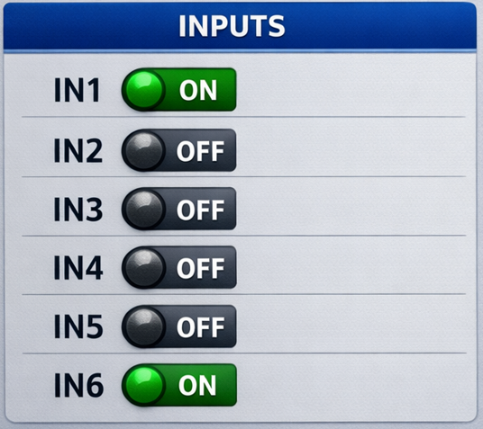
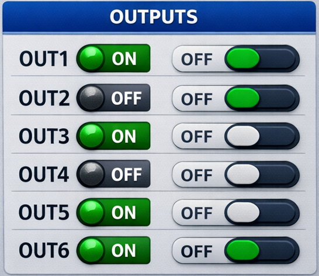

# ESP32 PLC Touch HMI (ESP32-2432S028 + LVGL)

## Overview

This project implements a **touchscreen Human Machine Interface (HMI)** for monitoring and controlling a PLC using an **ESP32-2432S028 (2.8" 240x320 TFT touchscreen)**.

The interface is built using **LVGL** and provides:

* Monitoring of **6 PLC inputs**
* Manual control of **6 PLC outputs**
* **Serial communication status indicator**
* **System status bar**
* Modular architecture using **FreeRTOS tasks**

The project is designed as a **starting point for industrial HMI development** with ESP32.

---

# Features

## GUI (LVGL)

The graphical interface contains:

### Inputs Panel

Displays the state of the PLC inputs using LED indicators.



LED color indicates state:

* Green → ON
* Gray → OFF

### Outputs Panel

Outputs can be manually controlled using touchscreen switches.



### Communication Indicator

Shows whether communication with the PLC is active.


* Green → communication OK
* Off → communication lost

### Status Bar

Displays system information or errors.

Example:


---

# Hardware

Recommended hardware:

* **ESP32-2432S028** (2.8" touchscreen display)
* **ILI9341 TFT controller**
* **XPT2046 touch controller**

# Software Architecture

The system uses **FreeRTOS tasks**.

```
+-------------------+
| GUI Task (LVGL)   |
| - Rendering       |
| - Touch input     |
+-------------------+

+-------------------+
| PLC Task          |
| - UART            |
| - Read inputs     |
| - Send outputs    |
+-------------------+

+-------------------+
| Main Loop         |
| - LVGL handler    |
+-------------------+
```

Data flow:

```
PLC -> ESP32 -> GUI
Touch -> GUI -> PLC
```

---

# Project Structure

```
plc_hmi/

src/
 ├── main.cpp        # Application entry point
 ├── gui.cpp         # LVGL interface
 ├── gui.h
 ├── display.cpp     # Display driver
 ├── display.h
 ├── plc_comm.cpp    # PLC communication
 └── plc_comm.h

lv_conf.h            # LVGL configuration
platformio.ini       # PlatformIO project configuration
```

---

# Dependencies

Libraries used:

* **LVGL 8.x**
* **TFT_eSPI**

---

# Build Environment

Recommended tools:

* **PlatformIO (VSCode)**
* **ESP32 Arduino Framework**

Example configuration:

```
platform = espressif32
board = esp32dev
framework = arduino
monitor_speed = 115200
```

---

# Running the Project

1. Install **VSCode + PlatformIO**
2. Clone or copy this project
3. Open the folder in PlatformIO
4. Build the project

```
PlatformIO: Build
```

5. Upload firmware

```
PlatformIO: Upload
```

6. Open serial monitor

```
115200 baud
```

---

# PLC Communication

The current implementation contains a **simulation** of PLC inputs.

Replace the logic inside:

```
src/plc_comm.cpp
```

with real communication such as:

* **Custom UART protocol**

Example:

```
read_inputs_from_plc()
send_output_command()
```

---

# Future Improvements

Recommended upgrades:

### Touch Driver

Add support for the **XPT2046 touch controller**.

### Alarm System

Add popup windows for faults.

### Manual / Auto Mode

Prevent manual control when PLC is in automatic mode.

### Diagnostics Screen

Display:

* RX packets
* TX packets
* Communication errors

---

# Example Use Cases

This HMI can be used for:

* Small industrial machines
* Educational PLC projects
* Lab automation
* Custom control panels
* IoT gateway for PLC systems

---

# License

Open-source example project for educational and prototyping purposes.

---

# Author

Designed as a starting point for **embedded engineers building ESP32 industrial HMIs using LVGL**.

Optimized for developers familiar with:

* Embedded C/C++
* FreeRTOS
* Serial protocols
* Industrial control systems
